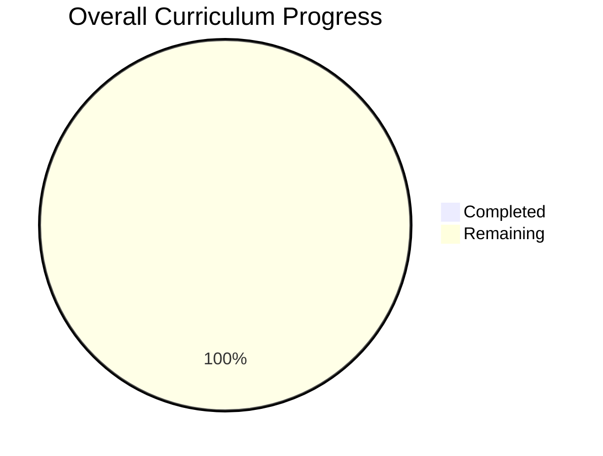
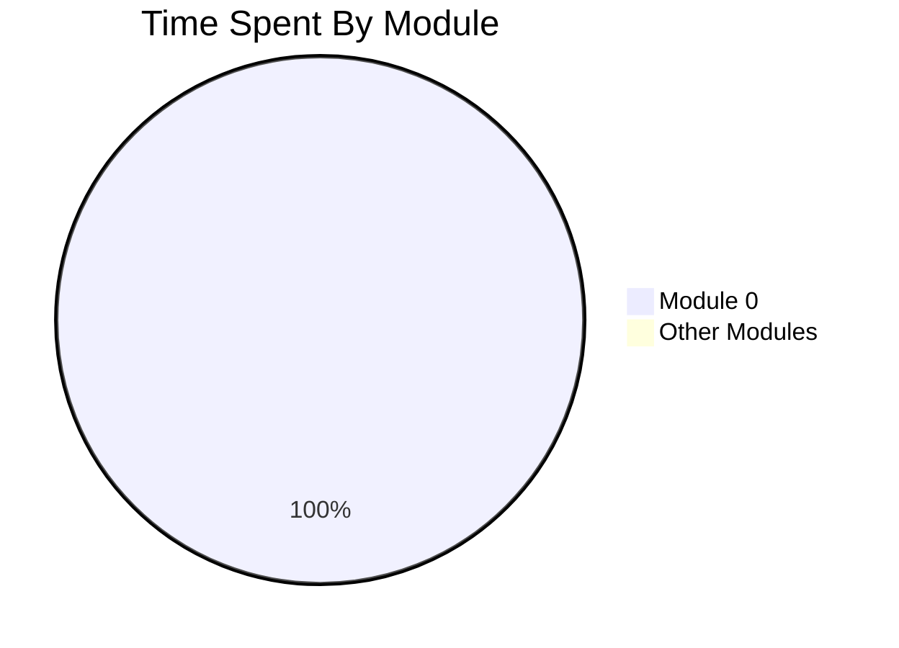

# Progress Dashboard

Last updated: 2026-09-23

## Current State

| Metric | Value |
|---|---:|
| Current module | Module 0 - JavaScript Foundations |
| Current focus | Arrays, objects, functions as values |
| Module completion | 10% |
| Total time spent | 0 minutes |
| Active days | 0 |
| Sessions completed | 0 |
| Recall sessions completed | 0 |
| Checkpoints passed | 0 |
| Project features completed | 0 |

## Metrics To Track

| Metric | Why it matters |
|---|---|
| `time_spent_minutes` | Measures effort and pacing |
| `cumulative_hours` | Shows total investment over time |
| `active_days` | Shows consistency |
| `documentation_pages_read` | Ensures syntax comes from docs |
| `worked_examples_typed` | Confirms examples were typed manually |
| `problems_attempted` | Measures active practice |
| `problems_solved_independently` | Measures independence |
| `problems_solved_with_hints` | Shows where support was needed |
| `concepts_explained_correctly` | Measures understanding, not just code |
| `recall_score_percent` | Measures retention after checkpoints |
| `project_features_completed` | Tracks portfolio progress |
| `tests_written` | Measures engineering maturity |
| `bugs_resolved` | Measures debugging practice |
| `refactors_completed` | Measures design growth |
| `confidence_rating_1_to_5` | Captures student self-assessment |
| `stuck_points` | Feeds the next recall session |

## Module Progress

| Module | Status | Completion | Time Spent |
|---|---:|---:|---:|
| Module 0 - JavaScript Foundations | `[~]` | 10% | 0 min |
| Module 1 - Describing the UI | `[ ]` | 0% | 0 min |
| Module 2 - Adding Interactivity | `[ ]` | 0% | 0 min |
| Module 3 - Managing State | `[ ]` | 0% | 0 min |
| Module 4 - Escape Hatches | `[ ]` | 0% | 0 min |
| Module 5 - Performance and Modern React | `[ ]` | 0% | 0 min |
| Module 6 - Frontend Ecosystem | `[ ]` | 0% | 0 min |
| Module 7 - Capstone | `[ ]` | 0% | 0 min |

## Module Completion Formula

```text
module_completion =
  20% documentation and typed examples
+ 25% exercises/problems
+ 25% project feature work
+ 20% checkpoint explanation
+ 10% recall retention
```

## Charts

Markdown can display Mermaid line and pie charts in many viewers. A true
calendar heatmap is not native Mermaid, so this file uses an HTML table heatmap.
Update the chart values after each session.

### Cumulative Time Line Graph

```mermaid
xychart-beta
  title "Cumulative Study Time"
  x-axis ["Start"]
  y-axis "Minutes" 0 --> 60
  line [0]
```

### Progress Pie Graph



### Time By Module Pie Graph



### Daily Work Heatmap

Use intensity values:

- `0` = no work
- `1` = 1-30 minutes
- `2` = 31-60 minutes
- `3` = 61-120 minutes
- `4` = more than 120 minutes

<table>
  <tr>
    <th>Date</th>
    <th>Minutes</th>
    <th>Intensity</th>
    <th>Heat</th>
  </tr>
  <tr>
    <td>2026-09-23</td>
    <td>0</td>
    <td>0</td>
    <td style="background:#ebedf0;width:80px;">&nbsp;</td>
  </tr>
</table>

## Current Stuck Points

- None logged yet.

## Next Session Target

Complete Day A, Day B, and Day C exercises from Module 0, then explain the
approach before receiving corrections.
